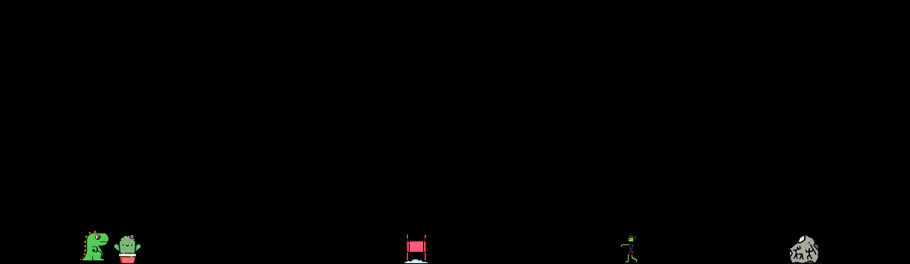

# Игра - Препятствия Dino

Игра на подобии Google Dino. Нужно преодолевать препятствия на пути Динозаврика, набирать очки и соревноваться с друзями. Сама игра написана на технологии Canvas разработчиком Anteyku в целях практики и познания работы некоторых алгоритмов для дальнейшей более сложной разработке игор. В процессе разработки, я сталкивался с проблемой воспроизведения реалистичной анимации физики при падании и прыжке динозавра. Ссылка на игру - https://anteyku.github.io/gameDino/
# Используемые технологии
 + Canvas

